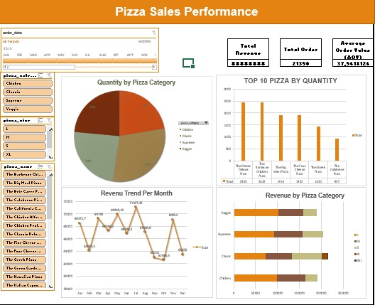

# 🍕 Pizza Sales Performance Analysis

### 🎯 Project Goal

This project aims to deliver actionable business insights by analyzing historical pizza sales data. The goals are specifically:
1.  **To Process and Cleanse Raw Data** (`pizza_sales_raw.csv`) into an analysis-ready dataset (`Data Clean.csv`).
2.  **To Measure Key Business Performance Indicators (KPIs)**.
3.  **To Derive Insights** for sales planning and strategic decision-making.

---

### 🛠️ Tools & Data Process

This section showcases the end-to-end process, highlighting the efficiency of using widely accessible tools.

| Phase | Main Tool | Process Detail & Corresponding Files |
| :--- | :--- | :--- |
| **Data Cleaning** | **Google Sheets / Microsoft Excel** | Raw data validation, standardization, and error handling. **The `Data Clean.csv` file is the result of this thorough cleaning process.** |
| **Analysis & Modeling** | **Microsoft Excel** | KPI calculations, trend analysis, and use of Pivot Tables/Functions for data aggregation. |
| **Visualization** | **Microsoft Excel Dashboard** | Building a dynamic dashboard for visual presentation of findings (`Dashboard Interaktif.jpg`). |

### 📊 Key Performance Indicators (KPIs) & Quick Insights

| Metric | Value | Business Relevance |
| :--- | :--- | :--- |
| **Total Order** | [Insert Your Total Orders Value] | Measures overall demand and transaction volume. |
| **AOV (Average Order Value)** | [Insert Your AOV Value] | Critical for maximizing revenue per transaction through upselling strategies. |

**Key Insights:**
* **Demand Trend:** A strong seasonal sales pattern was identified (peak in **[Insert Peak Month]**). *(Crucial for resource planning and inventory management).*
* **Product Focus:** The top-selling pizzas are **[Insert 1-2 Top Sellers]**, indicating where marketing and stocking efforts should be prioritized.

---

### 🖼️ Final Dashboard Visualization

